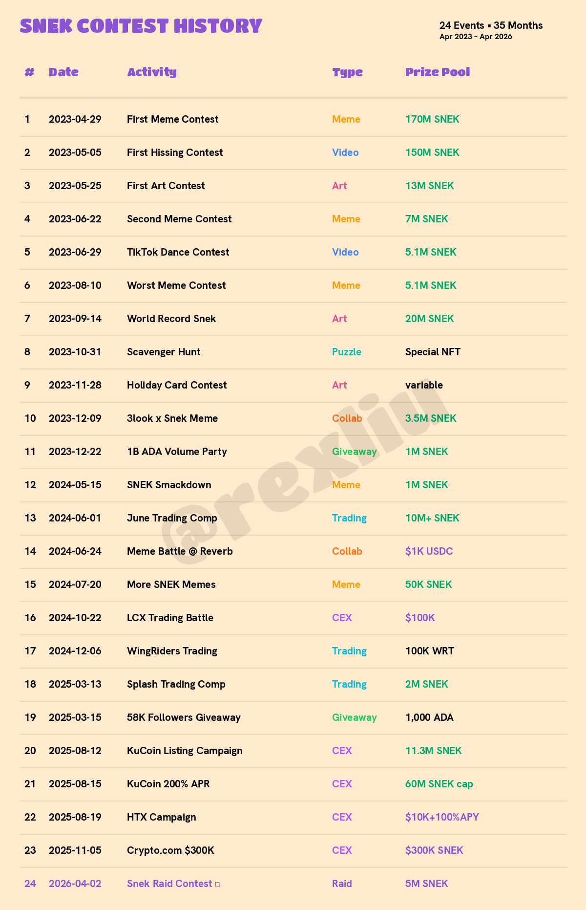
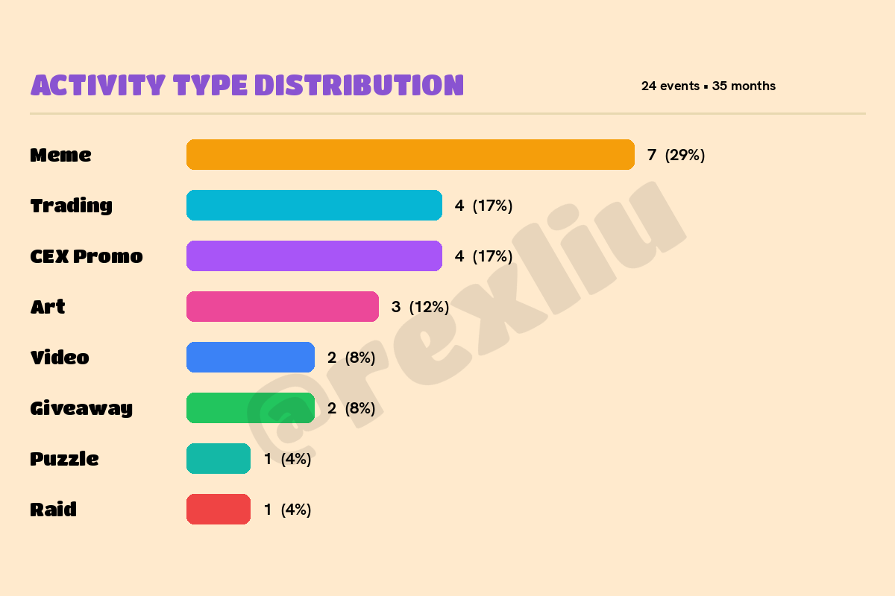

$SNEK just launched its latest contest: the Snek Raid — 5,000,000 $SNEK up for grabs. Post about Snek. Win $SNEK. Simple.

But this is not just another giveaway. It is chapter 24 in a three-year story that most people have not been tracking.

I went back through every single $SNEK community contest since April 2023. Here is the full picture.

## The Complete Record

| # | Date | Activity | Type | Prize Pool |
|---|------|----------|------|------------|
| 1 | 2023-04-29 | First Meme Contest | Meme | 170M SNEK |
| 2 | 2023-05-05 | First Hissing Contest | Video | 150M SNEK |
| 3 | 2023-05-25 | First Art Contest | Art | 13M SNEK |
| 4 | 2023-06-22 | Second Meme Contest (#DogeToSnek) | Meme | 7M SNEK |
| 5 | 2023-06-29 | First TikTok Dance Contest | Video | 5.1M SNEK |
| 6 | 2023-08-10 | Worst Meme Contest | Meme | 5.1M SNEK |
| 7 | 2023-09-14 | World Record Snek | Art | 20M SNEK |
| 8 | 2023-10-31 | Scavenger Hunt | Puzzle | Special NFT |
| 9 | 2023-11-28 | Holiday Card Contest | Art | variable |
| 10 | 2023-12-09 | 3look x Snek Meme Contest | Meme / Collab | 3.5M SNEK |
| 11 | 2023-12-22 | 1 Billion ADA Volume Celebration | Giveaway | 1M SNEK |
| 12 | 2024-05-15 | SNEK Smackdown (Consensus 2024) | Meme | 1M SNEK |
| 13 | 2024-06-01 | June Trading Competition | Trading | 10M+ SNEK |
| 14 | 2024-06-24 | Great Meme Battle at Reverb | Meme / Collab | $1,000 USDC |
| 15 | 2024-07-20 | More SNEK Meme Contest | Meme | 50K SNEK |
| 16 | 2024-10-22 | LCX Trading Battle | Trading / CEX | $100K prize pool |
| 17 | 2024-12-06 | WingRiders SNEK Trading Competition | Trading / Collab | 100K WRT |
| 18 | 2025-03-13 | SNEK Trading Competition on Splash | Trading | 2M SNEK |
| 19 | 2025-03-15 | 58K Followers Giveaway | Giveaway | 1,000 ADA |
| 20 | 2025-08-12 | KuCoin Listing Campaign | CEX Promo | 11.3M SNEK |
| 21 | 2025-08-15 | KuCoin 200% APR Promotion | CEX Promo | 60M SNEK cap, 200% APR |
| 22 | 2025-08-19 | HTX $SNEK Campaign | CEX Promo | $10K SNEK + 100% APY |
| 23 | 2025-11-05 | Crypto.com $300K Campaign | CEX Promo | $300K in SNEK |
| 24 | 2026-04-02 | **Snek Raid Contest** | **Raid** | **5M SNEK** |

## By the Numbers

- **Total events**: 24 across 35 months
- **Total SNEK distributed** (confirmed community contests): ~390M+ SNEK
- **Total CEX promo value**: $410K+ (LCX $100K + HTX $10K + Crypto.com $300K) + KuCoin 11.3M SNEK + 60M SNEK staking
- **At ATH** ($0.009286, Dec 2024): community contest pool ≈ $3.6M
- **At current price** (~$0.0004): ≈ $156K

## Activity Type Distribution

| Type | Count | % | Key Examples |
|------|-------|---|-------------|
| Meme contests | 7 | 29% | First Meme (170M), DogeToSnek, 3look collab |
| Trading competitions | 4 | 17% | June 2024, LCX $100K, WingRiders, Splash |
| CEX promotions | 4 | 17% | KuCoin (listing + 200% APR), HTX, Crypto.com $300K |
| Art / Creative | 3 | 13% | World Record Snek, Holiday Cards |
| Video (Hissing / TikTok) | 2 | 8% | TikTok hit 1.3M views |
| Giveaways / Celebrations | 2 | 8% | 1B ADA volume milestone, 58K followers |
| Puzzles | 1 | 4% | Halloween Scavenger Hunt |
| Raid contests | 1 | 4% | Current (April 2026) |

## Four Patterns

**1. Early explosion, then strategic shift.**

345M SNEK distributed in the first 90 days (Apr–Jun 2023) — 88% of all confirmed community contest tokens. The goal was raw awareness. By 2024, contest sizes shrank but partnerships expanded: Consensus 2024, Reverb, 3look, WingRiders. Distribution shifted from mass airdrops to ecosystem integration.

**2. CEX partnerships escalated fast — and became the biggest prize pools.**

The progression: WingRiders DEX (Dec 2024) → LCX $100K Trading Battle (Oct 2024) → Splash (Mar 2025) → KuCoin listing + 200% APR + 11.3M SNEK (Aug 2025) → HTX $10K + 100% APY (Aug 2025) → Crypto.com $300K with 21,000 winners (Nov 2025).

From Cardano DEX to LCX to KuCoin to HTX to Crypto.com — each step moved up the exchange ladder. By late 2025, CEX promotions alone accounted for over $410K in prize value, dwarfing all community contests combined.

**3. Trading competitions emerged as a second pillar.**

Four trading competitions across 2024–2025 (June 2024, LCX Oct 2024, WingRiders Dec 2024, Splash Mar 2025). This format generates real on-chain volume and attracts traders who may not care about memes but follow incentives. The June 2024 trading comp was billed as the largest Cardano had ever seen. The LCX battle brought $100K in prizes to a regulated European exchange.

**4. The team's focus shifted to infrastructure — now it's coming back to community.**

From mid-2024 through 2025, the team put its energy into exchange listings and institutional partnerships — LCX, KuCoin, HTX, Crypto.com. That was the right priority at the time. Building liquidity rails and global access is foundational work that benefits every holder.

During that period, day-to-day community engagement never stopped. Discord stayed active. The official account kept posting. Community members organized their own initiatives independently. What this list tracks is official team-driven contests — and on that front, the focus was clearly elsewhere.

Now the Snek Raid brings it full circle. The exchange infrastructure is in place. The liquidity is there. It is time to turn the energy back to the people who kept showing up.

**Important note**: this record only covers official team-organized activities. Community-driven initiatives — meetups, fan art, meme threads, local groups — are not included here but have been a constant thread throughout SNEK's history.

## Why This Moment Matters

The Snek Raid is not just another contest. It is the starting signal for a new chapter.

- The exchange rails are built: KuCoin, HTX, Crypto.com, LCX — all live. That infrastructure does not disappear.
- The Snekified avatar campaign gives every community member a visual identity. When your timeline fills with SNEK-styled profile pictures, that is organic brand presence no ad budget can buy.
- Snek Den global meetups turn online engagement into real-world connections. Singapore, Dubai, wherever the community gathers — these events create the kind of bonds that survive bear markets.
- A Snek Ambassador program is the natural next step. Turn the most active community members into recognized contributors. Gamified incentives bring people in. Real titles and responsibility make them stay.

24 official events. 35 months. From 170 million SNEK memes to a $300K Crypto.com campaign and now back to the grassroots.

The community has been here all along. Some of us never left.

Now the team is matching that energy. And this Snek Raid is just the beginning.

Let's flood the timeline. 🐍

---

Still SNEK. Still here.

*This record covers official SNEK team-organized contests and campaigns from Apr 2023 to Apr 2026. Data compiled from official @snek Twitter/X posts, Discord announcements, and exchange campaign pages (KuCoin, HTX, LCX, Crypto.com). Community-driven independent initiatives are not included in this count.*
